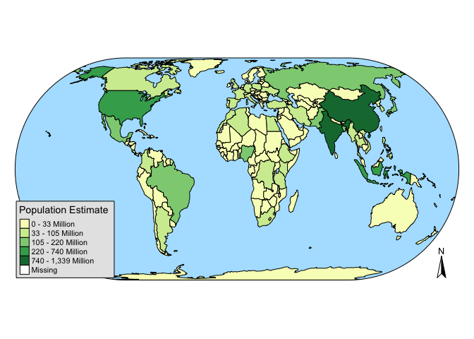

# sp_projects

  

## Greece 

 

Recently I completed Data Camp's short course on [*Working With
Geospatial Data in
R*](https://www.datacamp.com/courses/working-with-geospatial-data-in-r),
taught by Charolette Wickham. The course was around four hours long and
introduced a variety of packages and methods for geospatial analysis
using R. It's an engaging tutorial, and was well worth my time, even
though I'm not hoping to specialize in spatial analysis. Loading,
manipulating, and visualizing spatial data can have a steep learning
curve, but it's pretty fun once you get the hang of it.

To help cement these blossoming skills, This post is dedicated to
creating spatial visualizations to help me plan my next hypothetical
adventure abroad! To begin, I need to load some essential spatial
analysis packages. The packages `ggmap`, `sp`, `tmap`, `rgdal`,
`classInt`, and `viridisLite` were all covered in Data Camp's spatial
analysis course. The course also covered `raster`, `tigris`, and
`RColorBrewer`, but I'm not going to use them in this post, I'd rather
narrow my focus to ggmap and tmap for now.

 

    library('tidyverse')    
    library('ggmap')
    library('sp')
    library('tmap')
    library('rgdal')
    library('classInt')
    library('viridisLite')

 

Now that the packages are loaded, let's download some data and have a
look at the world to get the wanderlust flowing!

 

    # Load World dataset from package tmap
    data("World")

    # Plot the world according to population
    tm_shape(World) + 
      tm_borders() +
      tm_fill(title = "Population Estimate", 
              col = "pop_est", 
              style = "fisher",
              labels = c("0 - 33 Million",
                         "33 - 105 Million",
                         "105 - 220 Million", 
                         "220 - 740 Million", 
                         "740 - 1,339 Million"
                         )
              ) + 
      tm_style_natural() + 
      tm_compass() + 
      tm_layout(frame = F)

This is a pretty cool map, informative and pleasing to the eye. I think
the `fisher` method of processing the color breaks for population was a
good choice. Now let's see the world divided up by economic development!
I just recently got back from a trip to South East Asia, and I'm looking
to go somewhere a little more developed this time!

 

    # Create a custom color palette
    vir <- viridis(5)

    # Plot the world based on economic development
    tm_shape(World) + 
      tm_borders() + 
      tm_compass() + 
      tm_fill(title ="Economic Development",
              col = "economy",
              palette = vir,
              style = "quantile"
              ) 

I really like the `viridisLite` color palettes, they’re specially
designed to work with color-blindness and they translate to grayscale
well. After viewing this plot of economic development, I'm thinking that
a trip to Europe will be in my near future! But what part of Europe?

 

    # Load tmap package data on Europe
    data(Europe)

    # Plot a map of Europe based on geographic divisions
    tm_shape(Europe) + 
      tm_borders() + 
      tm_fill(title = "Part",
              col = "part",
              palette = vir,
              textNA = "Not Europe"
              ) + 
      tm_style_white() 

 

Don't let Czechia know that the `tmap` package considers them Eastern
Europe! Of course, these divisions come from the United Nations
Statistical Division, and don't include a category for Central Europe.
Moving forward, I think a trip to Southern Europe would be just what I'm
looking for! Let's have a look at just the countries of Southern Europe,
with the colors based on population.

 

    # make a variable to plot only Southern Europe countries
    s_europe <- Europe$part == "Southern Europe"

    # loop through s_europe and remove N/A 
    for (i in seq_along(s_europe)) {
      if ( is.na(s_europe[[i]]) ) {
        s_europe[[i]] <- FALSE
      } 
    }

    # Reset the color palette for 4 variables
    vir <- viridis(4)

    # Map Southern Europe by population
    tm_shape(Europe[s_europe,]) + 
      tm_borders() +   
      tm_fill(title = "Population Estimate (millions)",
              col = "pop_est", 
              palette = vir,
              labels = c("0 - 20",
                         "20 - 40", 
                         "40 - 60", 
                         "60 - 80")
              ) + 
      tm_style_white() + 
      tm_text("iso_a3", size="AREA", root=5) +
      tm_layout(title = "Southern Europe by Population",
                inner.margins = c(0.05, 0.1, 0.25, 0.05),
                scale = 0.85
                )

There's probably an easier way to plot only the countries of Southern
Europe, but I wanted a chance to practice my iteration skills. Of these
countries, I've decided that Greece is the place for me! Even though
I've already been twice before, I think a third trip is just what I'm
looking for. I've downloaded a shapefile from
[here](http://geodata.gov.gr/en/dataset?tags=administrative-units) to
practice using the `rgdal` package for loading spatial data.

    # Read in a the greece shapefile. 
    grc_shape <- readOGR("input/periphereies", "periphereies")

    ## OGR data source with driver: ESRI Shapefile 
    ## Source: "input/periphereies", layer: "periphereies"
    ## with 13 features
    ## It has 1 fields

    # What kind of data is included in this shapefile?
    str(grc_shape, max.level = 2)

    ## Formal class 'SpatialPolygonsDataFrame' [package "sp"] with 5 slots
    ##   ..@ data       :'data.frame':  13 obs. of  1 variable:
    ##   ..@ polygons   :List of 13
    ##   ..@ plotOrder  : int [1:13] 2 8 10 1 5 9 3 4 12 7 ...
    ##   ..@ bbox       : num [1:2, 1:2] 104011 3850811 1007936 4623914
    ##   .. ..- attr(*, "dimnames")=List of 2
    ##   ..@ proj4string:Formal class 'CRS' [package "sp"] with 1 slot

 

    # Visualize greece with Greek flag colors
    tm_shape(grc_shape, simplify = .5) + 
      tm_borders(lwd = 1, col = "#ffffff") + 
      tm_fill(col = "#0D5EAF") + 
      tm_layout(frame = F,
                title = "GREECE",
                fontface = 4)

While this visualization isn't extremely informative, it's nice to look
at! The white and blue color combination mimics the Greek flag. The
shapefile I created this map from has data stored within it, but it's
all written using math symbols! Ah well, it's all Greek to me.

Now I need to get down to buisness and find somewhere to stay! How about
an Airbnb? Good thing Airbnb has an awesome feature for easy DIY data
visualization! I was able to retrieve information on Airbnb in Athens
from <http://insideairbnb.com/get-the-data.html>.

 

    # load the stored airbnb .csv file
    athens_airbnb <- read_csv("input/airbnb_data.csv")

    # google and set coordinates for the city of athens
    athens_coord <- c(lon = 23.7325, lat = 37.9868)

    # from classInt package, divide airbnb prices into 5 categories 
    classIntervals(athens_airbnb$price, n = 5, style = "quantile")

    ## style: quantile
    ##    [9,25)   [25,35)   [35,46)   [46,69) [69,5000] 
    ##       780      1081      1208      1021      1037

    breaks <- c(9,25,35,46,69,5000)
    labels <- c("$9 - $25", "$25 - $35", "$35 - $46", "$46 - $69", "$69+")
    athens_airbnb$price <- cut(athens_airbnb$price, breaks = breaks, labels = labels)

    # retrieve map for athens based on coordinates
    athens <- get_map(athens_coord, zoom = 13, scale = 1, maptype="terrain")

    # remove NA prices 
    athens_airbnb <- athens_airbnb %>%
      filter(!is.na(price))

    # Plot airbnb by price in Athens
    ggmap(athens) + 
      geom_point(data = athens_airbnb, 
                 aes(longitude, latitude, col = price), 
                 alpha = 0.5) + 
      theme_set(theme_bw()) + 
      theme(legend.key=element_blank(),
            axis.ticks = element_blank(),
            axis.text = element_blank(),
            axis.title = element_blank()) + 
      scale_color_manual(name = "Price per Night", 
                         values = c("#0D0887FF", "#7E03A8FF", "#CC4678FF", "#F89441FF", "#F0F921FF"))

 

It looks like there are a lot of low-budget options for accommodation in
Athens! That's great, but I'm feeling like a big-spender. Let's see the
swankiest stays that Airbnb has to offer! And I only stay in places that
have a few reviews on them already, to make sure they're legit.

 

    # I only want to stay next to the Acropolis 
    acropolis_coord <- c(lon = 23.7257, lat = 37.9715)
    athens_zoom <- get_map(acropolis_coord, zoom = 15, scale = 1, maptype="terrain")

    # load airbnb data 
    athens_airbnb <- read_csv("input/airbnb_data.csv")

    # Filter for the most expensive airbnb's with reviews 
    swanky_bnb <- athens_airbnb %>%
      filter(price > 150 & number_of_reviews > 5)

    # use the classInt package to divide the prices into five categories 
    classIntervals(swanky_bnb$price, n = 5, style = "quantile")

    ## style: quantile
    ##   one of 58,905 possible partitions of this variable into 5 classes
    ##  [154,171)  [171,200)  [200,250)  [250,313) [313,1000] 
    ##         12          9         11         13         12

    breaks <- c(154,171,200,250,313,1000)
    labels <- c("$154 - $171", "$171 - $200", "$200 - $250", "$250 - $313", "$313 - $1000")
    swanky_bnb$price <- cut(swanky_bnb$price, breaks = breaks, labels = labels)

    # filter out the NA prices
    swanky_bnb <- swanky_bnb %>%
      filter(!is.na(price))

    # map of the swankiest Airbnbs in Athens
    ggmap(athens_zoom) + 
      geom_point(data = swanky_bnb, 
                 aes(longitude, latitude, col = price), 
                 alpha = 0.8, 
                 size = 6) + 
      theme_set(theme_bw()) + 
      theme(legend.key=element_blank(),
            axis.ticks = element_blank(),
            axis.text = element_blank(),
            axis.title = element_blank()) + 
      scale_color_manual(name = "Price per Night", 
                         values = c("#0D0887FF", "#7E03A8FF", "#CC4678FF", "#F89441FF", "#F0F921FF"))

 

I think that \$250 - $315 BnB next to Hadrian's Library is the one for
me! I'm sure this would have been easier to do on Airbnb.com, but then I
wouldn't have been able to practice my R skills would I?

To make up for spending so much on accommodation, I think I'll have make
my own souvenirs ahead of time! How about a nice painting of the most
famous Greek island, Santorini?

 

    # Load Santorini Lat / Lon coordinates
    santorini_coord <- c(lon = 25.4115, lat = 36.4052)

    # Download a watercolor map of Santorini
    invisible(santorini <- get_map(santorini_coord, zoom = 12, scale = 1, maptype="watercolor"))

    # Plot the map 
    ggmap(santorini) + 
      theme(legend.key=element_blank(),
            axis.ticks = element_blank(),
            axis.text = element_blank(),
            axis.title = element_blank())

 

That's great! And I want a modern-style map of the streets of Athens
too!

 

    # declare the coordinates to Athens again
    athens_coord <- c(lon = 23.7205, lat = 37.9780)

    # Download a terrain-lines map of Athens
    invisible(greece <- get_map(athens_coord, zoom = 12, scale = 1, maptype = "terrain-lines"))

    # plot the map
    ggmap(greece) + 
        theme(legend.key=element_blank(),
            axis.ticks = element_blank(),
            axis.text = element_blank(),
            axis.title = element_blank())

 

Alright! I'm all ready to go on my trip and planning it was half the
fun. The `ggmap` and `tmap` packages have so many applications, and I'm
excited to explore beyond this cursory example of their capabilities. So
much to learn so little time!

Until next time,

- Fisher

